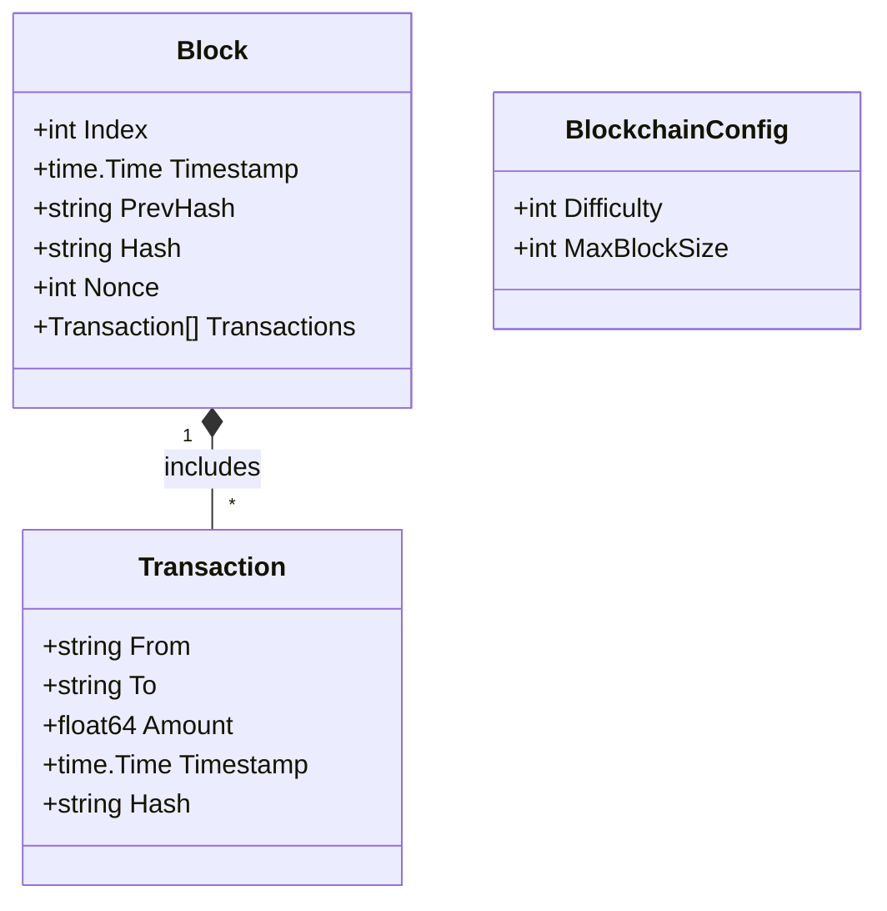
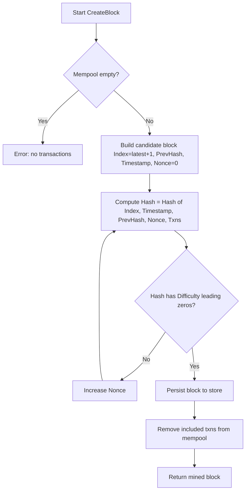

# ⛓️ SimChain

An educational, minimal blockchain implemented in Go. SimChain demonstrates core blockchain concepts end‑to‑end: transactions, a mempool, blocks, persistence, a simple proof‑of‑work miner driven by configurable difficulty, and an HTTP API to interact with the chain.

### 🎯 What you’ll learn
- How blocks and transactions are modeled
- How a mempool feeds block creation
- How proof‑of‑work (PoW) mining with leading‑zero difficulty works
- How a genesis block is created and persisted
- How to expose a simple REST API over a blockchain core

---

## 🏗️ Architecture

- **Domain (`internal/domain`)**: Pure data models and interfaces.
- **Blockchain (`internal/blockchain`)**: Concrete implementation of the domain.
- **API (`internal/api`)**: HTTP layer using Gin.
- **Utility (`internal/utility`)**: Hashing and serialization helpers.
- **Entrypoint (`cmd/simchain/main.go`)**: Wires dependencies and starts the API server.

Persistence is provided by BadgerDB. The store tracks blocks by sequential index and maintains the latest block index for fast lookup.

---

## 🧩 Data model



- **Block**: ordered record with `PrevHash` link, mined via PoW using `Nonce`.
- **Transaction**: simple value transfer with hash over sender, receiver, amount, timestamp.
- **BlockchainConfig**: runtime parameters; `Difficulty` controls PoW leading zeros; `MaxBlockSize` reserved for future enforcement.

---

## ⛏️ Mining (Proof‑of‑Work)



- Hash material includes block index, timestamp, previous hash, nonce, and the serialized transactions.
  
- Increasing `Difficulty` makes block creation slower (exponentially on average).

---

## 🌱 Genesis block

On node startup, `NewBlockchain` checks the store. If no blocks exist, it creates and persists a genesis block (`Index = 0`, empty transactions, empty `PrevHash`). This ensures `CreateBlock` always has a valid parent.

---

## 🔌 REST API

- **Base URL**: `http://localhost:8081`

### Endpoints
- `POST /transaction/new`
  - Enqueue a transaction into the mempool.
  - Body:
    ```json
    { "from": "alice", "to": "bob", "amount": 1.23 }
    ```

- `GET /transaction/pending`
  - List pending (unmined) transactions.

- `POST /block/create`
  - Mine a new block from current mempool contents using PoW based on `Difficulty`.
  - Response includes a short message with the block index and transaction count.

- `GET /block/history`
  - Return the full chain as an ordered list of blocks.

#### Example (PowerShell)
```powershell
curl -X POST http://localhost:8081/transaction/new -H "Content-Type: application/json" -d '{"from":"alice","to":"bob","amount":2.5}'
curl -X GET  http://localhost:8081/transaction/pending
curl -X POST http://localhost:8081/block/create
curl -X GET  http://localhost:8081/block/history
```

---

## 🚀 Running

From the repository root:
```powershell
go run ./cmd/simchain
```

Build a binary:
```powershell
go build -o simchain ./cmd/simchain
./simchain # (or .\simchain.exe on Windows)
```

The server listens on port `8081` by default.

### 💾 Data directory
The BadgerDB data directory is created by the store (see `NewBadgerStore("./.db")`). You can change the path in `cmd/simchain/main.go`.

---

## ⚙️ Configuration

`BlockchainConfig` is wired in `cmd/simchain/main.go`:
- **Difficulty**: number of leading zeros required in the block hash
- **MaxBlockSize**: future use; can be used to constrain block contents

To make mining faster or slower, adjust `Difficulty` (e.g., 2–4 for quick demos).

---

## 🗂️ Project layout (actual)

```
simchain/
├── cmd/
│   └── simchain/
│       └── main.go
├── internal/
│   ├── api/
│   │   ├── controllers/
│   │   │   ├── block.go
│   │   │   └── transaction.go
│   │   └── server.go
│   ├── blockchain/
│   │   ├── block_store.go
│   │   ├── blockchain.go
│   │   └── transaction_pool.go
│   ├── domain/
│   │   ├── block.go
│   │   ├── blockchain.go
│   │   ├── block_store.go
│   │   ├── transaction.go
│   │   └── transaction_pool.go
│   └── utility/
│       ├── hash.go
│       └── serialization.go
├── go.mod
├── go.sum
└── README.md
```

---

## 🧭 Notes and next steps
- Add basic validation for transactions and blocks
- Add persistence for the mempool or recovery logic on startup
- Add P2P networking for multi‑node syncing and block propagation
- Add unit tests and simple benchmarks for mining difficulty
